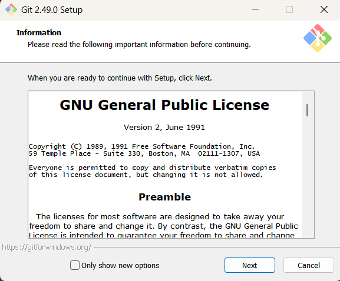
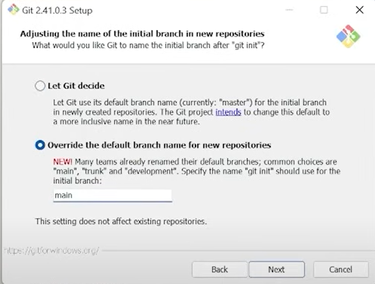
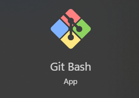
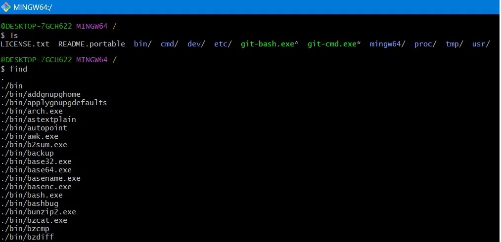
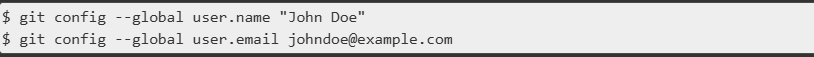

## **What is a “Version Control System”?**
Version control systems are a category of software tools that help track changes made to files. They are essential for developers to record modifications in code, collaborate efficiently, and revert to previous versions when needed.

**🔑 Key Skill:** Learning version control — especially Git — is a fundamental skill for developers.
### **Suggested Reading**
- Version Control Systems – [GeeksforGeeks](https://www.geeksforgeeks.org/version-control-systems/)
## **Tools We’ll Be Using**
For Learner’s Space, we’ll focus on **Git** and **GitHub**
### **Git**
Git is a version control system — a tool that lets you track changes made to files over time. It's especially useful for developers working on code, as it allows you to:

- Save versions of your project at different stages.
- Undo mistakes by reverting to older versions.
- Collaborate with others without messing up each other's code.
- Branch out and experiment without affecting the main codebase.
### **GitHub**
GitHub is an **online platform** where you can **store your Git repositories in the cloud** and share them with others. It provides:

- **Remote storage** for Git repositories.
- Tools for **collaboration** (pull requests, issues, comments).
- A place to **showcase your projects**, contribute to open-source, or work in teams.

Git and github are related in the same way as a word document and google docs!

## **Git: Installation**
### **For Windows:**
- Download:[git-scm.com/download/win\
  ](https://git-scm.com/download/win)
- Run the installer with default settings.

Select [On the Desktop] option if you want to see its icon on the desktop.

 
 This is another additional change you are advised to do…

And continue the rest with the default settings…
### **For macOS:**
Most versions of MacOS will already have Git installed, and you can activate it through the terminal with git version.  However, if you don't have Git installed, you can install the latest version of Git as listed below:

- Download:[git-scm.com/download/mac\
  ](https://git-scm.com/download/mac)
- Installation help:[How to Install Git on Mac | Configure Git and github on Mac (2024)](https://www.youtube.com/watch?v=9GZmaxaQV0c)

Follow the video instructions if you encounter any trouble.
## **Git Bash**
Once Git is installed, open **Git Bash**, the command-line tool for Git.

- To open it: type **“Git Bash”** in the search bar (Windows).

This is where you’ll commit files into your **local repositories**, before pushing them to **remote repositories** (like GitHub).
## **Git Setup (First-time users)**
Open Git Bash and run the following commands to configure Git with your details:

git config --global user.name "Your Name"

git config --global user.email "you@example.com"

For official setup instructions, see:[Git Setup – git-scm.com](https://git-scm.com/book/en/v2/Getting-Started-First-Time-Git-Setup)

## **Common Git Commands**
🖼 *[Insert Git command list screenshot]*

🧩 **Quick Reference:**

- [GitHub Git Cheat Sheet (PDF)\
  ](https://education.github.com/git-cheat-sheet-education.pdf)
- [Official Git Reference Docs](https://git-scm.com/docs)[\
  ](https://education.github.com/git-cheat-sheet-education.pdf)
- [git-cheat-sheet.pdf](https://about.gitlab.com/images/press/git-cheat-sheet.pdf)[\
  ](https://education.github.com/git-cheat-sheet-education.pdf)
- [Git Cheat Sheet | GeeksforGeeks](https://www.geeksforgeeks.org/git-cheat-sheet/)
## **GitHub: Setup**
1. Go to[https://github.com/\
   ](https://github.com/)
1. Sign up and log in with your preferred email address.
## **First Commit + Push**
Watch these tutorial videos to make your first Git commit and push to GitHub:

- [Complete Git and GitHub Tutorial for Beginners](https://www.youtube.com/watch?v=Ez8F0nW6S-w) - Hind [\
  ](https://www.youtube.com/watch?v=video-for-windows)
- [Complete Git and GitHub Tutorial](https://www.youtube.com/watch?v=apGV9Kg7ics) - English
## **Extra Resources (Optional)**
- [Git-SCM Videos\
  ](https://git-scm.com/videos)
- [Stack Overflow – Git Questions\
  ](https://stackoverflow.com/questions/tagged/git)
- [Reddit – r/git](https://www.reddit.com/r/git/)

.

